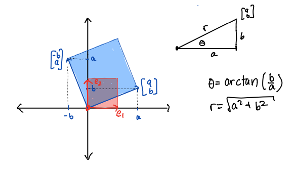

# Complex Eigenvalues

[Download this Rmd file](https://github.com/Tom-Halverson/math236_s21/blob/main/08-complex-eigenvalues.Rmd)

Now we will explore what happens if the matrix has complex eigenvalues.

## Rotation-Dilation

First we explore a special case of 2x2 matrices with complex eigenvalues of the following form:
$$
R=\begin{bmatrix}
a & -b \\
b & a \\
\end{bmatrix}
$$
As we see in the image below, this matrix rotates by angle of $\theta$ and expands (dilates) or contracts by a factor of $r$ where
$$
\begin{align}
\theta &= \arctan(b/a) \\
r &= \sqrt{a^2 + b^2}
\end{align}
$$
{width=75%}

Furthermore the eigenvalues of this matrix are the complex values
$$
\lambda_1 = a + b i \qquad \lambda_2 = a - b i
$$
where $i = \sqrt{-1}$. These eigenvalues are conjugate pairs and are often written as
$\lambda = a \pm b i$. They come from applying the quadratic formula to the characteristic polynomial and getting a negative discriminant under the square root. It is important to note that both **the angle of rotation $\theta$ and the dilation factor $r$ are contained in the eigenvalues.** The fact that these are the eigenvalues is derived in the video. We will illustrate it here in three examples.

### Example 1

Our first example has $a = .9$ and $b = .2$.
```{r}
(A = cbind(c(.9,.2),c(-.2,.9)))
```

We look at its eigenvectors and eigenvalues and see that $\lambda = .9 \pm .2 i$:
```{r,echo=TRUE}
eigen(A)
```
Notics that the eigenvectors also come in conjugate pairs, with a real and a complex part. This always happens.
$$
\vec{\mathsf{v}} = 
\begin{bmatrix}0.707 \\ 0.000 \end{bmatrix} \pm 
\begin{bmatrix} 0.000 \\ .707 \end{bmatrix}  i
$$
Now, let's find the **angle of rotation**. We will use the `Arg` command which finds the angle (in radians) of a complex number. We also convert it to degrees here. 

```{r,echo=TRUE}
vals = eigen(A)$values
v1 = vals[1]
Arg(v1)  # gives the argument, or angle, of a complex number (in radians)
Arg(v1) / (2*pi) * 360 # convert to degrees
```

For good measure, we can compare with using the `arctan` function.

```{r,echo=TRUE}
atan(.2/.9)  
```

Next we find the **dilation/contraction factor**. We can do so using the `Mod` command, which finds the "modulus" or absolute value or length of a complex number.

```{r,echo=TRUE}
Mod(v1) # gives the length of a complex number
```

And, again for good measure, we compare with using the Pythagorean theorem:
```{r,echo=TRUE}
sqrt(.9^2 + .2^2)  
```

Now, we observe the trajectory of a single point $(0,1)^T$ under this matrix. In this picture you can see that it is contracting and rotating by 12.5 degrees. Note that 360/12.5 is about 29, and it takes 29 applications to go once around the circle. You can count them in the plot below. Furthermore, $(0.9219544)^29 =0.095$ and after 29 applications the vector is about 1/10 of its original length.

```{r,fig.width=6, fig.height=6}

N = 50
start = c(1,0)
X = matrix(0,nrow=2,ncol=N)
X[,1] = start
for (i in 2:N) {X[,i] = A %*% X[,i-1]}

plot(X[1,],X[2,],col='blue',xlim=c(-1,1),ylim=c(-1,1),xlab='x',ylab='y',pch=20,cex=1)
points(start[1],start[2],col="red")
grid(nx=10,ny=10)
```
We can also view this by looking at a plot of the x and y coordinates over time as the point (x,y) circles around in the xy-plane. Key point: complex eigenvalues lead to oscillating values of the individual coordinates

```{r}
t = seq(1,N)
plot(t,X[1,],type='l',col='blue',ylim=c(-1,1),ylab="x and y coordinates",xlab="t (time) ")
lines(t,X[2,],col='darkorange')
legend(15, 0.8, legend=c("x", "y"), col=c("blue", "darkorange"), lty=1)
```


```{r, echo=FALSE}
get_traj <- function(mat, x0, num) {
  traj = cbind(x0) 
  num
  for (i in 1:num) {
    traj = cbind(traj, mat %*% traj[,dim(traj)[2]])
    traj
  }
  return(traj)
}

plot_traj <- function(mat, x0, num) {
  traj = get_traj(mat,x0,num)
  points(traj[1,],traj[2,], pch=20, col=rainbow(length(traj)))
}

trajectory_plot <- function(mat, t=20, datamax=5, plotmax=10, numpoints=10, showEigenspaces=TRUE) {
  # initialize plot
  par(pty = "s")
  plot(c(0),c(0),type="n",
       xlim=c(-plotmax,plotmax),ylim=c(-plotmax,plotmax),
       xlab='x', ylab='y')
  abline(h=-plotmax:plotmax, v=-plotmax:plotmax, col="gray")
  mygrid <- expand.grid(x=seq(from = -datamax, by = 2*datamax/numpoints, l = numpoints+1),
                      y=seq(from =  -datamax, by = 2*datamax/numpoints, l = numpoints+1))
  for (t in 1:dim(mygrid)[1]) {
    plot_traj(A,c(mygrid[t,1],mygrid[t,2]),t)
  }
  if (showEigenspaces) {
    eigen = eigen(A)
    #mylabel = cat('lambda=', eigen$values[1], 'and lambda=', eigen$values[2])
    #title(xlab=mylabel)
    v1 = zapsmall(eigen$vectors[,1])
    v2 = zapsmall(eigen$vectors[,2])
    if (! class(v1[1]) == "complex") {
      if (v1[1] == 0) {
        abline(v=0)
      } else {
        abline(a=0,b=v1[2]/v1[1], col="blue")
      } 
      
      if (v2[1] == 0) {
        abline(v=0)
      } else {
        abline(a=0,b=v2[2]/v2[1], col="blue")
      }   
    }
    
  }
}
```

We can also use `trajectory_plot` from [Dynamical Systems in 2D] to watch what happens to a whole grid of points under this transformation. It is beautiful!

```{r,fig.height=7, fig.width=7, echo=TRUE}
trajectory_plot(A, t=30, datamax=5, plotmax=5, numpoints=10)
```


### Example 2

Here is a second example of a rotation-dilation matrix, this time with $a = .96$ and $b = .28$.

```{r,echo=TRUE}
(A = cbind(c(.96,.28),c(-.28,.96)))
eigen(A)
```

We check the angle of rotation and the dilation factor

```{r,echo=TRUE}
vals = eigen(A)$values
v1 = vals[1]
Arg(v1)  # gives the argument, or angle, of a complex number (in radians)
Arg(v1) / (2*pi) * 360 # convert to degrees
Mod(v1)  # gives the length of a complex number
```
Notice that the dilation factor is 1, which is seen in the following plots. Here are 21 iterations:

```{r,fig.height=4, fig.width=6}
# plot
N = 21
start = c(1,0)
X = matrix(0,nrow=2,ncol=N)
X[,1] = start
for (i in 2:N) {X[,i] = A %*% X[,i-1]}

plot(X[1,],X[2,],col='blue',xlim=c(-1,1),ylim=c(-1,1),xlab='x',ylab='y',pch=20,cex=1)
points(start[1],start[2],col="red")
grid(nx=10,ny=10)
```

And here are 200 iterations
```{r,fig.height=4, fig.width=6}
# plot
N = 200
start = c(1,0)
X = matrix(0,nrow=2,ncol=N)
X[,1] = start
for (i in 2:N) {X[,i] = A %*% X[,i-1]}

plot(X[1,],X[2,],col='blue',xlim=c(-1,1),ylim=c(-1,1),xlab='x',ylab='y',pch=20,cex=1)
points(start[1],start[2],col="red")
grid(nx=10,ny=10)
```

And a trajectory plot:
```{r,fig.height=7, fig.width=7}
trajectory_plot(A, t=30, datamax=5, plotmax=5, numpoints=10)
```

### Example 3

A third and final example.

```{r,echo=TRUE}
(A = cbind(c(.99,.16),c(-.16,.99)))
eigen(A)
vals = eigen(A)$values
v1 = vals[1]
Arg(v1) / (2*pi) * 360 # convert to degrees
Mod(v1)  # gives the length of a complex number
```

We see that the dilation factor is $r = 1.0028$ and the angle of rotation is $9.18$ degrees. Here are 100 iterations.


```{r,fig.width=6, fig.height=4}
# plot
N = 100
start = c(1,0)
X = matrix(0,nrow=2,ncol=N)
X[,1] = start
for (i in 2:N) {X[,i] = A %*% X[,i-1]}

plot(X[1,],X[2,],col='blue',xlim=c(-2,2),ylim=c(-2,2),xlab='x',ylab='y',pch=20,cex=1)
points(start[1],start[2],col="red")
grid(nx=10,ny=10)
```

And a trajectory plot:
```{r,fig.height=7, fig.width=7}
trajectory_plot(A, t=100, datamax=5, plotmax=5, numpoints=10)
```


## General 2x2 Matrices with Complex Eigenvalues

Now suppose we have a 2x2 matrix with complex eigenvalues $\lambda = a \pm b i$ and complex eigenvectors $\mathsf{v} = \mathsf{u } \pm \mathsf{w} i$ that is not in rotation-dilation form. Here is an example:
$$
A = \begin{bmatrix} 1.19 & -0.38 \\ 0.29 & 0.78 \end{bmatrix}
$$
It has eigenvalues and eigenvectors
$$
\lambda = 0.985 \pm 0.261 i \qquad \mathsf{v} = 
\begin{bmatrix} 0.753 \\ 0.406 \end{bmatrix} \pm 
\begin{bmatrix} 0.000 \\ -0.517 \end{bmatrix} i
$$
as seen here:

```{r}
(A = cbind(c(1.19,0.29),c(-.38,.78)))
eigen(A)
```

The angle of rotation and factor of dilation are $\theta = 14.8$ degrees and $r = 1.019$ as we see from these computations:
```{r}
vals = eigen(A)$values
v1 = vals[1]
Arg(v1) / (2*pi) * 360 # convert to degrees
Mod(v1)  # gives the length of a complex number
```

A trajectory plot shows us that it is still rotating by 14.8 degrees and dilating by 1.019, but it is taking more of an elliptical pattern.
```{r,fig.width=6, fig.height=4}
A = cbind(c(1.19,0.29),c(-.38,.78))
vecs = eigen(A)$vectors
u = Re(vecs[,1])
w = Im(vecs[,1])
N = 50
start = c(1,0)
X = matrix(0,nrow=2,ncol=N)
X[,1] = start
for (i in 2:N) {X[,i] = A %*% X[,i-1]}

plot(X[1,],X[2,],col='blue',xlim=c(-3,3),ylim=c(-3,3),xlab='x',ylab='y',pch=20,cex=1)
points(start[1],start[2],col="red")
lines(c(10*u[1],-10*u[1]),c(10*u[2],-10*u[2]),col="purple")
lines(c(10*w[1],-10*w[1]),c(10*w[2],-10*w[2]),col="purple")
grid(nx=10,ny=10)
```

To see precisely what happens, we change to basis $\{\mathsf{w}, \mathsf{u}\}$ where $\mathsf{w}$ and $\mathsf{u}$ are the imaginary and real parts of the eigenvector $\mathsf{v} =\mathsf{u}  +  \mathsf{w} i$. In this case the eigenvalues and eigenvectors are
$$
\lambda = 0.985 \pm 0.261 i \qquad \mathsf{v} = 
\begin{bmatrix} 0.753 \\ 0.406 \end{bmatrix} \pm 
\begin{bmatrix} 0.000 \\ -0.517 \end{bmatrix} i
$$
So if we make the change of basis matrix $P = [\mathsf{u},\mathsf{w}]$
$$
P = \begin{bmatrix}
0.000 &  0.753 \\
-0.517 & 0.406 \end{bmatrix}
$$
then we can factor $A$ as
$$
A = \begin{bmatrix} 1.19 & -0.38 \\ 0.29 & 0.78 \end{bmatrix} = 
\underbrace{\begin{bmatrix}0.000 &  0.753 \\-0.517 & 0.406 \end{bmatrix}}_P
\underbrace{\begin{bmatrix} 0.985 & - 0.261 \\ 0.261 & 0.985 \end{bmatrix}}_R
\underbrace{\begin{bmatrix}0.000 &  0.753 \\-0.517 & 0.406 \end{bmatrix}^{-1}}_{P^{-1}}
$$
We have not diagonalized $A$. Rather we have **rotation-dilationalized** (made up term) the matrix $A$. At is *core* $A$ is a rotation-dilation matrix whose angle and dilation factor come from the eigenvalue. The matrix $P$ is a change of basis matrix. It is rotating and dilating in this new coordinate system, which are the vectors in the plot above.

If we multiply the other way, we get
$$
P^{-1} A P = \begin{bmatrix} 0.985 & - 0.261 \\ 0.261 & 0.985 \end{bmatrix} = R
$$
Which we can see using R
```{r}
vecs = eigen(A)$vectors
P = cbind(Im(vecs[,1]),Re(vecs[,2]))
P
solve(P) %*% A %*% P
```


<!-- ## A 3D example -->

<!-- Here is the Northern Spotted Owl matrices from the [Eigenvalues] examples. We saw that it has one real and two complex eigenvalues: -->

<!-- ```{r} -->
<!-- A = cbind(c(0,0.18,0),c(0,0,.71),c(0.33,0,0.94)) -->
<!-- eigen(A) -->
<!-- ``` -->

<!-- The eigenvalues are always listed in descending order by magnitude as we see here when we compute their modulus and arguments -->
<!-- ```{r} -->
<!-- Mod(eigen(A)$values) -->
<!-- Arg(eigen(A)$values)/(2 *pi)*360 -->
<!-- ``` -->


<!-- We can diagonalize this over the complex numbers.  -->
<!-- ```{r} -->
<!-- P = eigen(A)$vectors -->
<!-- zapsmall(solve(P) %*% A %*% P) -->
<!-- ``` -->
<!-- It has complex eigenvalues on the diagonal and requires using the complex vectors in our basis. Often, this is not what we want to do if our matrix has real entries and comes from a real-valued problem.  -->

<!-- Instead, let's rotation-dilationalize this matrix. The block diagonalization consists of a 1x1 block of the real eigenvalue and a 2x2 block of the rotation-dilation part of the complex eigenvalues. -->

<!-- ```{r} -->
<!-- vecs = eigen(A)$vectors -->
<!-- P = Re(cbind(vecs[,1],Im(vecs[,2]),Re(vecs[,2]))) -->
<!-- P -->
<!-- zapsmall(solve(P) %*% A %*% P) -->
<!-- ``` -->
<!-- In 3 dimensions, there the geometry is as follows: -->
<!-- * there is one basis vector, corresponding to the real eigenvalue $\lambda = 0.985$ -->
<!-- * there is a plane in which the system rotates by $\theta = 96$ degrees and contracts by $r = 0.207$. -->
<!-- * thus, the complex part dies off pretty quickly ($r = 0.207$), and it converges to the dominant real eigenvector, which is also dying off but more slowly ($r = 0.983$) -->

<!-- We can see this in the traectory plot below. The oscillating part at the beginning comes from the complex eigenvalues as they quickly die off and the system converges to the dominant real eigenvector. -->

<!-- ```{r,echo=FALSE,fig.width=7, fig.height=7} -->
<!-- A = cbind(c(0,0.18,0),c(0,0,.71),c(0.33,0,0.94)) # the population dynamics matrix -->
<!-- x0 = c(70,600,8) # the inital value -->
<!-- N = 15  # iterate N=100 times -->
<!-- X = matrix(0,nrow=nrow(A),ncol=N+1) # initialize an all 0 matrix to store values in -->
<!-- X[,1] = x0 # the first column is the initial population -->
<!-- for (i in 2:(N+1)) {  # loopn from 2 to N+1 -->
<!--   X[,i] = A %*% X[,i-1] # Apply A to column i-1 and put the value in column i -->
<!-- } -->
<!-- tot = X[1,] + X[2,] + X[3,] -->
<!-- t = seq(1,N+1) -->
<!-- plot(t,X[1,],type='l',col='blue',ylim=c(0,800),ylab="population",xlab="year",main="Spotted Owl Population") -->
<!-- points(t,X[1,],col='blue',pch=20,cex=.8) -->
<!-- lines(t,X[2,],col='orange') -->
<!-- points(t,X[2,],col='orange',pch=20,cex=.8) -->
<!-- lines(t,X[3,],col='red') -->
<!-- points(t,X[3,],col='red',pch=20,cex=.8) -->
<!-- points(t,tot,col='black',pch=20,cex=.8) -->
<!-- lines(t,tot,col='black') -->
<!-- legend(8,750, legend=c("juvenile", "subadults", "adults","total"), col=c('blue','orange','red','black'), lty=1) -->
<!-- ``` -->