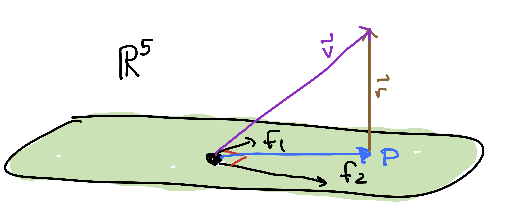

# Problem Set 7

* Due: Tuesday March 09 by 11:59am CST. 
* Upload your solutions to Moodle in a PDF. 
* Please feel free to **use RStudio for all calculations, including row reduction, matrix multiplication, eigenvector calculation and inverse matrices.**
* You can download the [Rmd source file  for this problem set](https://github.com/Tom-Halverson/math236_s21/blob/main/PS7-problem-set-7.Rmd).

This problem set covers [Network Centralities] and Sections 6.1, 6.2, and 6.3 on Orthogonal Projections.


## The Rise of Moscow

Read [Network Centralities] and analyze the network of trade routes in medieval Russia given to you there.

a. Create a vector containing the normalized Degree Centralities. See Section \@ref(degree-centrality) for help.

a. Create a vector containing the Gould Index values. See Section \@ref(gould-index-summary) for help.

a. Plot the network where the size of the vertices is determined by Gould's Index and the size of the label is determined by degree centrality.

a. Create a data frame that contains Gould's Index and Degree Centralities. The rows should be labeled with the city names and the columns should be named by the centrality measures.  Sort according to Gould's Index.

a. Use Gould's Index to decide whether Moscow's dominance was solely due to its geographic location.

a. Compare the Gould's Index and Degree Centrality rankings and note any interesting findings. See Section \@ref(step-5) for help.


## Orthogonal Complements


Here are two subspaces of $\mathbb{R}^5$ that we have seen before. (See PS4.2 and PS5.2)
$$
\begin{align}
\mathsf{Z} & = \left\{ \begin{bmatrix} x_1 \\ x_2 \\ x_3 \\ x_4 \\ x_5 \end{bmatrix} \ \bigg\vert \ x_1 + x_2 + x_3 + x_4 + x_5 = 0 \right\}.
\\
\mathsf{F} & = \left\{ \begin{bmatrix} x_1 \\ x_2 \\ x_3 \\ x_4 \\ x_5 \end{bmatrix} \ \bigg\vert \  x_3 =  x_1 + x_2, x_4 = x_2 + x_3, x_5 = x_3 + x_4 \right\}.
\end{align}
$$
Find the orthogonal complement of each subspace in $\mathbb{R}^5$. For each example, compute $\dim(W) + \dim(W^\perp)$.

## Orthogonal Diagonalization

Recall that a square $n \times n$ matrix is symmetric when $A^{\top} = A$. We learned that the eigenvectors of a symmetric matrix form an orthogonal basis of $\mathbb{R}^n$. In this problem, you will confirm that this holds for the following symmetric matrix
$$
A = 
\begin{bmatrix}
 0 &  8 & 10 & -4 \\
 8 & 4 & 28 & 6 \\
 10 & 28 & 3 & -4 \\
 -4 & 6 & -4 & -7
\end{bmatrix}. 
$$

a. Find the eigenvalues and eigenvectors of $A$.

b. Confirm that the eigenvectors returned by R are an orthonormal set (do this in a single calculation).

c. Express the vector $\mathsf{v} = \begin{bmatrix} 2 & -4 &  -9  & -2 \end{bmatrix}^{\top}$ as a linear combination of the eigenvectors. Use the fact that the eigenvectors are orthonormal. (Don't augment and row reduce.)

d.  Let $P$ be the matrix of these normalized, orthogonal eigenvectors.
Diagonalize $A$ using $P$. Just write out $A = P D P^{-1}$. Congratulations: you have **orthogonally diagonalized** the symmetric matrix $A$!

**Turn in:** Your R code and the output for each part. For parts (c) and (d), you need to make it clear what your final answers are. 

## Cosine Similarity 

In high dimensional space $\mathbb{R}^n$ a common measure of similarity between two vectors  is  **cosine similarity**:  the cosine of the angle $\theta$ between the vectors. We calculate this value as follows:
$$
\cos(\theta) = \frac{ \mathsf{u} \cdot \mathsf{v}} {\| \mathsf{u}\| \, \|\mathsf{v}\|} = \frac{ \mathsf{u} \cdot \mathsf{v}} {\sqrt{\mathsf{u} \cdot \mathsf{u}} \sqrt{\mathsf{v} \cdot \mathsf{v}}}.
$$
This measure has the following nice properties:

* $-1 \le \cos(\theta) \le 1$,
* $\cos(\theta)$ is close to 1 if $\mathsf{u}$ and $\mathsf{v}$ are closely aligned,
* $\cos(\theta)$ is close to 0 if  $\mathsf{u}$ and $\mathsf{v}$ are are orthogonal, 
* $\cos(\theta)$ is close to $-1$ if $\mathsf{u}$ and $\mathsf{v}$ are polar opposites.
* $\cos(\theta)$ is positive if $\theta$ is acute (less than $90^o$).
* $\cos(\theta)$ is negative if $\theta$ is obtuse (greater than $90^o$).


a. Write a function `cosine_similarity` that takes as input two vectors $\mathsf{u}$ and $\mathsf{v}$ and returns the value of $\cos(\theta)$ for the angle $\theta$ between $\mathsf{u}$ and $\mathsf{v}$. Below is a shell of the code that you need. Right now it always just returns 1.You need to fix that up. Demonstrate that your code works on some vectors in $\mathbb{R}^5$. Use vectors that are orthogonal, closely aligned, and close to polar opposites.

```{r,echo=TRUE}
cosine_similarity <- function(u, v) {
  # your code goes here!
  # find the cosine of the angle between u and v
  cosine = 1
  return (cosine)
}
```


b. In the file [US_Senate_s21.Rmd](https://drive.google.com/open?id=1oN6-rlOBdDj7LLzzwFC4RGkKiLIUJDcV) you will find vectors of the voting record of the Senate in the 109th US Congress (2007-2008). You will see how to take the dot product of the voting record of two different senators. The dot product is always an integer. Explain what it counts. It is the number of something or possibly the difference of two things.

c. Use your `cosine_similary` function to find the cosine similarity between every pair of the following senators:

    + Hilary Clinton (D, NY), presidential candidate 2016
    + John McCain (R, AZ), presidential candidate 2008
    + Barack Obama (D, IL), president 2008-2016
    + Susan Collins (R, ME), moderate Republican

Does the cosine similarity pick up on the fact that Senator Collins is a "moderate Republican"?

d. The senate majority leader of the 109th Congress was Bill Frist (R, TN), and the senate minority leader was Harry Reid (D, NV). 

    * Create a function  `classify_senator(senator)` that returns "R" or "D" depending on the cosine similarity of `senator` to `frist` and to `reid`. You will have to write [an "if ... else statement" (here is the syntax)](https://www.tutorialspoint.com/r/r_if_else_statement.htm).
  
    * There is a chunk of code in the R file I've given you that gets you started.

    * Then run the my_classification code that we have given. I dentify any senators that have been *misclassified* using this method, meaning that their votes are more similar to the leader of the opposing party. 
    
    * Jim Jeffords (I, VT) was a Republican who became and Independent in 2001 and then caucused with the Democrats. How does your classifier handle Jeffords?


## Fibonacci Orthogonality

In problem 1, you saw that the vector space of Fibonacci vectors $\mathsf{F} \subseteq \mathbb{R}^5$ is a 2-dimensional subspace of $\mathbb{R}^5$. 


a. Below is an orthogonal basis of $\mathsf{F}$. Check that the basis vectors $\{\mathsf{f}_1, \mathsf{f}_2\}$ are in $\mathsf{F}$ and are orthogonal.
$$
\mathsf{F} = \mathsf{span} \left\{
 \mathsf{f}_1 = \begin{bmatrix} 1 \\ 0 \\ 1 \\ 1 \\ 2 \end{bmatrix}, 
 \mathsf{f}_2 = \begin{bmatrix} -9 \\ 7 \\ -2 \\ 5 \\ 3\end{bmatrix}
 \right\}, \hskip.5in
 \mathsf{v}  =  \begin{bmatrix} 1 \\ 2 \\ 3 \\ 5 \\ 7\end{bmatrix}.\hskip.5in
$$
{width=70%}

b. The vector $\mathsf{v}$ above is \emph{not} in $\mathsf{F}$ (check that!). Its **projection** $\mathsf{p}$ onto $\mathsf{F}$ is given by the formula below. Compute $\mathsf{p}$. This is closest approximation of $\mathsf{f}$ with a Fibonacci vector.
$$
\mathsf{p} = \frac{ (\mathsf{v} \cdot  \mathsf{f}_1)}{ ( \mathsf{f}_1 \cdot  \mathsf{f}_1)} \mathsf{f}_1 +  \frac{ (\mathsf{v} \cdot  \mathsf{f}_2)}{ ( \mathsf{f}_2 \cdot  \mathsf{f}_2)}  \mathsf{f}_2.
$$
This formula requires that the basis be orthogonal.

c. The **residual vector** is the vector $\mathsf{r}  = \mathsf{v} - \mathsf{p}$. Compute $\mathsf{r}$.

d. Show that $\mathsf{r}$ is orthogonal to $\mathsf{f}_1$ and $\mathsf{f}_2$.

d. Compute $||\mathsf{r}||$. This is the distance from $\mathsf{v}$ to $\mathsf{F}$ (i.e., how far $\mathsf{v}$ is from being Fibonacci).

## Least Squares Solution to $\mathsf{A} x = \mathsf{b}$

Find the least-squares solution to the following inconsistent matrix equation $\mathsf{A} x  = \mathsf{b}$. 
$$
\left[
\begin{array}{ccc}
 1 & 1 & 2 \\
 1 & 0 & 2 \\
 -1 & 1 & 1 \\
 1 & 0 & 1 \\
 1 & 1 & 1 \\
\end{array}
\right] \begin{bmatrix} x_1 \\ x_2 \\ x_3 \end{bmatrix} = 
\begin{bmatrix} 7 \\  11 \\ -3 \\ 10 \\ 7 \end{bmatrix}. \hskip5in
$$
Here are the steps you should follow:

a. Show that this system of equations is inconsistent.
b. Make the normal equations: $\mathsf{A}^T \mathsf{A} x = \mathsf{A}^T \mathsf{b}$.
c. Solve the normal equations for $\hat{x}$ (by hand or software).
d. Get the projection $\hat{\mathsf{b}}$ of $\mathsf{b}$ onto $\mathrm{Col}(\mathsf{A})$ by $\hat{\mathsf{b}} = \mathsf{A} \hat{x}$.
e. Get the residual $\mathsf{r}  = \mathsf{b} - \hat{\mathsf{b}}$ and compute its length.


